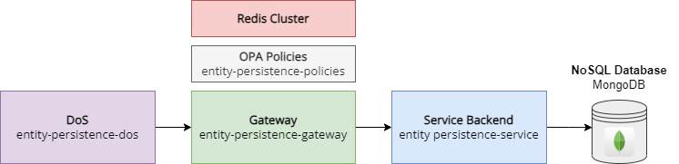
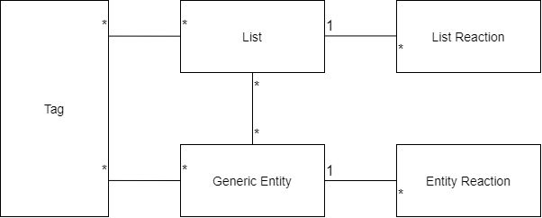

# Overview

The **Entity Persistence Service** is a flexible REST-based backend powered by the Loopback 4 framework. It utilizes schemaless MongoDB storage and offers adaptable data modeling, making it ideal for fast, secure, efficient REST API development.

Loopback 4 addresses various aspects of REST API development, yet many real-use case considerations remain unaddressed. These include but are not limited to authentication, granular authorization (RBAC), rate limiting, field masking, distributed locking, and more.

The Entity Persistence Service serves as a fundamental component within the **Tarcinapp Suite**, which encompasses a gateway and additional layers. Collectively, the Tarcinapp Suite effectively addresses these real-use case challenges, reducing the time to value for REST-based applications, and making development more efficient and productive.

## What is Tarcinapp Suite?

The Tarcinapp suite is a comprehensive and flexible application framework, harmoniously blending a suite of interconnected components designed to deliver a seamless and secure microservices architecture. It also provides the flexibility for users to leverage it as an upstream project for their own REST API-based backend implementations, allowing for easy adaptation to their specific requirements and use cases.

<p align="center">
  
</p>

At its core is the **Entity Persistence Service**, an easily adaptable REST-based backend application built on the [Loopback 4](https://loopback.io) framework. This service utilizes on a schemaless MongoDB database to provide a scalable and highly adaptable data persistence layer. Offering a generic data model with predefined fields such as `id`, `name`,  `kind`, `lastUpdateDateTime`, `creationDateTime`, `ownerUsers` and [more](#programming-conventions), it effortlessly adapts to diverse use cases.  

The integration with the **Entity Persistence Gateway** empowers users to implement enhanced validation, authentication, authorization, and rate-limiting functionalities, ensuring a secure and efficient environment. Leveraging the power of **Redis**, the application seamlessly manages distributed locks, enabling robust data synchronization and rate limiting. Furthermore, the ecosystem includes the **Open Policy Agent (OPA)** to enforce policies, safeguarding your application against unauthorized access and ensuring compliance with your security and operational requirements. These policies, combined with the entire suite of components, form a cohesive and powerful ecosystem, paving the way for efficient and secure microservice development.  
Here is an example request and response to the one of the most basic endpoint: `/generic-entities`:
<p align="left">
  
</p>  

**Note:** The client's authorization to create an entity, the fields that user can specify, and the fields returned in the response body may vary based on the user's role. The values of managed fields such as `visibility`, `idempotencyKey`, `validFromDateTime`, and `validUntilDateTime` can also be adjusted according to the user's role and the system's configuration.  
  
**Note**: Endpoints can be configured with arbitrary values within the gateway component. For example, `/books` can be used for records with `kind: book`, and the field `kind` can be completely omitted from the API interaction.

# Entity Persistence Service Application in Detail

This service is equipped with a versatile set of endpoints, each serving a specific purpose in managing and interacting with your data:

* `/generic-entities`: Handle your primary data models with this endpoint, facilitating CRUD (Create, Read, Update, Delete) operations.
* `/generic-lists`: Create, organize, and manage lists, enabling you to associate related data effortlessly.
* `/generic-lists/{listId}/generic-entities`: Create, organize, and manage lists, enabling you to associate related data effortlessly.
* `/generic-entities/{id}/reactions`: Capture user reactions, comments, likes, and more on specific entities.
* `/generic-lists/{id}/list-reactions`: Manage reactions, comments, likes, and other interactions associated with your lists.
* `/generic-entities/{id}/tags`: Add, modify, or remove tags associated with specific entities for efficient data categorization.
* `/generic-lists/{id}/tags`: Employ tags to categorize and organize your lists efficiently, ensuring effective data management.

## Data Model

The Entity Persistence Service is coming with a set of data models, each serving a unique purpose in organizing and managing your data. These data models lay the foundation for creating and categorizing entities and lists, handling user interactions, and facilitating effective data organization.
Combined with the diverse capabilities of the Entity Persistence Service, enable you to efficiently manage, categorize, and interact with your data, fostering a dynamic and user-friendly environment.
  
<p align="center">
  
</p>

### Generic Entity

The Generic Entity data model is at the heart of the Entity Persistence Service, representing fundamental objects within your application. These entities can encompass a wide range of data types, thanks to their schemaless nature. The key distinguishing feature of the Generic Entity is the kind field, which allows for straightforward differentiation between different types of objects. For instance, an entity can be categorized as a 'book' or 'author,' enabling easy data classification and organization. This versatile model serves as the basis for the majority of your data, offering a flexible structure that adapts to various use cases.

### List

The List data model is designed to efficiently organize collections of generic entities. A list can establish relationships with multiple entities, providing a mechanism for grouping and categorizing related data. Lists can be categorized using the kind field, allowing for logical organization based on content type or purpose. For example, a list could have a kind value of 'favorites' or 'science_fiction,' streamlining the management and categorization of lists within your application. This model simplifies the task of aggregating data and managing relationships, enhancing the user experience.

#### List-Entity Relation

Lists and entities are connected through the `GenericListGenericEntityRel` model. Having a seperated model for the relation helps user to store arbitrary data about the relation with the relation object. Relation objects have a dedicated endpoint, just like lists and entities. To interact with relation objects you can call `/generic-list-entity-relations` endpoint.

Model of the relation object is as follows:

```json
{
  "_kind": "string",
  "_creationDateTime": "2024-12-19T12:56:59.656Z",
  "_lastUpdatedDateTime": "2024-12-19T12:56:59.656Z",
  "_validFromDateTime": "2024-12-19T12:56:59.656Z",
  "_validUntilDateTime": "2024-12-19T12:56:59.656Z",
  "_listId": "string",
  "_entityId": "string",
  "_fromMetadata": {},
  "_toMetadata": {},
  "_idempotencyKey": "string",
  "_version": 0,
  "_lastUpdatedBy": "string",
  "_createdBy": "string",
  "_additionalProp1": {}
}
```

* You can query (get), create (post), replace (put), update (patch), delete (delete) entities through lists calling the endpoint: `/generic-list-entity-relations`.
* This endpoint supports `sets` just like other endpoints like `/generic-lists` and `/generic-entities`.
* Uniqueness, default visibility, idempotency, auto-approve, record-limit, response-limit settings can be configured for individual relationship records.

A sample response to the `/generic-list-entity-relations` endpoint is as follows:

```json
[
    {
        "_id": "a6d5f090-76ba-45c3-8ea2-9785f2237382",
        "_kind": "relation",
        "_lastUpdatedDateTime": "2024-12-16T17:42:01.522Z",
        "_validFromDateTime": null,
        "_validUntilDateTime": null,
        "_listId": "e24ad71e-9041-4570-affe-04db7aca2efb",
        "_entityId": "408d809c-ff00-4969-b8a0-01b8a64aa359",
        "_fromMetadata": {
            "_validFromDateTime": null,
            "_validUntilDateTime": null,
            "_visibility": "protected",
            "_ownerUsers": [
                "user-id-1",
                "user-id-2"
            ],
            "_ownerGroups": [],
            "_viewerUsers": [],
            "_viewerGroups": []
        },
        "_toMetadata": {
            "_validFromDateTime": null,
            "_validUntilDateTime": null,
            "_visibility": "private",
            "_ownerUsers": [],
            "_ownerGroups": [],
            "_viewerUsers": [],
            "_viewerGroups": []
        },
        "_idempotencyKey": "8e2a163a534476cd85db0a59dc5300ea2ee4f2494d4788ee77357cb30f8ef15c",
        "_version": 4,
        "_arbitraryProperty": "foo"
    }
]
```

Notice fields like `_fromMetadata` and `_toMetadata` fields are are added to the response along with managed fields.  
  
`_fromMetadata`: This field includes metadata (managed fields) of the source object, which is the list in this case.
`_toMetadata`: This field includes metadata (managed fields) of the target objcet, which is the entity in this case.  

**Note:** Creation or update operations always require existence of the list and entity specified by the ids.

With the help of the relationship between lists and entities users can interact with entities under a specific list calling this endpoint: `/generic-lists/{listId}/generic-entities`.

A sample response of the `GET` call to the `/generic-lists/{listId}/generic-entities` endpoint is as follows:

```json

```

### Entity Reaction

The Entity Reaction data model is responsible for capturing and managing a broad spectrum of events related to objects within your application. It offers the flexibility to represent a wide range of actions and interactions, including comments, likes, measurements, and emotional responses. With this model, your application can handle diverse reactions and interactions associated with entities effectively, enriching user engagement and data interactivity.

### List Reaction

Similar to the Entity Reaction model, the List Reaction data model is tailored to manage events associated with lists. It empowers your application to capture actions like comments, likes, measurements, and reactions linked to lists. This versatility ensures that your application can effectively handle a variety of reactions and interactions related to lists, enhancing user participation and interaction.

### Tags

The Tags data model offers a structured approach to categorizing and organizing entities and lists. Tags act as valuable tools for data classification and grouping. For instance, a book can be assigned tags such as 'science_fiction' or 'fantasy,' simplifying the process of data categorization and organization within your application. This feature is instrumental in streamlining data retrieval and management, making it easier for users to locate and engage with specific content.

## Features of Entity Persistence Service

### Essential Data Management

**Entity CRUD operations**: Perform Create, Read, Update, and Delete operations on entities for fundamental data management.  
**Entity approval**: Manage data approval processes, ensuring quality control.  
**Entity uniqueness**: Guarantee data integrity through unique entity constraints.  
**Entity ownership**: Control data access with well-defined ownership and permissions.  

### Data Organization

**Entity relationships**: Establish and manage connections between entities.  
**Hierarchical lists**: Create structured, hierarchical data categorization for organized data management.  
**Tagging entities**: Efficiently categorize and organize data using tags.  

### User Engagement

**Reactions to entities and lists**: Enable user interactions through likes, comments, and more.  
**Sub-reactions to reactions**: Enhance user engagement with detailed reactions.  
**Entity visibility**: Control data access with options for public, private, and protected visibility.  
**Adding entities to lists**: Organize related data by associating entities with lists.

### Advanced Data Control

**Customized validations**: Tailor validation rules to specific use cases.  
**Prebuilt queries**: Simplify data retrieval with predefined query sets.  
**Strong querying capability**: Benefit from Loopback's robust querying capabilities for data analysis.  

### Efficiency and Optimization

**Limiting total records**: Manage data loads by controlling the total number of records.  
**Limiting response items**: Streamline responses by specifying the maximum number of items to return.  
**Automatically Idempotency calculation**: Enhance transaction safety and data consistency with automatic Idempotency calculations.  

### Gateway Integration

**Special gateway application**: Access enhanced features and secure access control through a dedicated gateway: **entity-persistence-gateway**

## Sample Use Cases

1. **User Configuration Storage**  
  Every user has an entity record with the kind 'config.' Entities are labeled as 'mobileapp,' 'webui,' 'menu,' 'dashboard,' etc., to store arbitrary data for personalized user configurations. For example, the 'menu' entity stores the user's menu preferences, and the 'dashboard' entity stores the user's dashboard preferences.  
2. **IoT Platform**  
  Each list in the application represents a solution, and each solution contains entities representing IoT devices with the kind 'device.' The application records measurements as reactions, enabling real-time data tracking and analytics.

3. **Movie Database**  
  The application manages movies and directors as separate entities. Each movie and director has its own entity, and a relationship named 'director' connects directors with the movies they have directed. Users can create lists like 'watchlist' and 'watched' to organize their movie preferences. Editors can curate special lists like '10 Must-See Movies' for user recommendations.

4. **Task Management System**  
  The application serves as a task management system, allowing users and teams to efficiently manage tasks and projects. Each task is represented as an entity with attributes like name, description, due date, and assignee. Users can create lists to categorize tasks based on projects or priority levels.

5. **Recipe Management Application**  
  The application functions as a recipe management tool, helping users discover, save, and organize recipes. Each recipe is represented as an entity with details such as title, ingredients, instructions, and preparation time. Users can create lists like 'favorites' and 'tried recipes' to bookmark recipes they love or have tested.

6. **Fitness Tracker**  
  The application acts as a fitness tracker, assisting users in monitoring their workouts and progress. Each workout session is represented as an entity with attributes like date, exercise type, duration, and intensity. Users can create lists to categorize workouts based on specific activities or fitness goals.

## Concepts

### Relations

Relations are individual records just like generic-entities and lists. Relations can hold arbitrary data along with the managed fields. Each time a relation is queried existence of the source and the target record is always checked. With the help of the relations entities under specific list, or reactions under specific list or entity can be queried.  
`/generic-lists/{listId}/generic-entities`  
`/generic-entities/{entityId}/reactions`  
While querying the target record with the notation above, users can filter by the relation object using the `filterThrough` extension. For instance:  
`/generic-lists/{listId}/generic-entities?filterThrough[where][kind]=consists`  

### Sets

Sets are a powerful feature introduced in the application, designed to streamline data filtering and selection. They provide a convenient and flexible way to retrieve specific subsets of data based on predefined conditions or custom logical combinations.

**Features of Sets:**

1. **Combining Sets with Logical Operators:** Sets can be combined using logical operators such as AND, OR, and NOT, enabling users to construct complex queries tailored to their specific needs.
`?set[and][0][actives]&set[and][1][publics]`
2. **Default Filtering with Sets:** Users can still apply default filtering to sets. For example, using the query parameter **`set[actives]&filter[where][kind]=config`** allows users to select all active data with a **`kind`** value of **`config`**.
3. **setThrough:** Users can apply `setThrough` query parameter while querying a data through relationship such as `/generic-lists/{listId}/generic-entities?setThrough[actives]`. This query will retrieve entities under the list specified by `{listId}` and relation record is active.
4. **Enforced Sets for Role-Based Access Control:** Sets can be enforced, ensuring that users work on specific predefined sets. The Gateway application facilitates the creation of sets according to role-based access control policies, enhancing data security and access control.
5. **whereThrough**: Users can apply `whereThrough` query parameter while performing delete or updateAll on the generic-entities through relationship such as `PATCH /generic-lists/{listId}/generic-entities?whereThrough[foo]=bar`. This operation will be applied to the entities under the list specified by `{listId}` and the relationship record with the field `foo` equals to `bar`.
6. **Sets with Inclusion Filter**: Users can apply sets to include filter. For example: `?filter[include][0][relation]=_genericEntities&filter[include][0][set][and][0][actives]&filter[include][0][set][and][1][publics]`

**List of Prebuilt Sets:**
The application comes with a set of prebuilt sets to simplify common data selections. Each set is designed to retrieve specific subsets of data based on predefined conditions. Here are the prebuilt sets:

| Set Name  | Description                                                                                                                                                                                                                                                                                  |
| --------- | -------------------------------------------------------------------------------------------------------------------------------------------------------------------------------------------------------------------------------------------------------------------------------------------- |
| publics   | Selects all data with a visibility (visibility) value of public.                                                                                                                                                                                                                                          |
| actives   | Selects all data where the _validFromDateTime is not null, less than the current date time, and the_validUntilDateTime field is either null or greater than the current date time.                                                                                                            |
| inactives | Selects all data where the _validUntilDateTime field has a value and is less than the current date time.                                                                                                                                                                                      |
| pendings  | Selects all data where the _validFromDateTime field is empty.                                                                                                                                                                                                                                 |
| owners    | Selects all data where the given user ID is in the _ownerUsers or the given group is in the_ownerGroups. User IDs and groups should be provided as comma-separated values in the query variable: set[owners][userIds]=userId1,userId2&set[owners][groupIds]=groupId1,groupId2.                |
| viewers   | Selects all data where the given user ID is in the _viewerUsers or the given group is in the_viewerGroups. User IDs and groups should be provided as comma-separated values in the query variable: set[viewers][userIds]=userId1,userId2&set[viewers][groupIds]=groupId1,groupId2.            |
| day       | Selects all data where the creationDateTime field is within the last 24 hours.                                                                                                                                                                                                               |
| week      | Selects all data where the creationDateTime field is within the last 7 days.                                                                                                                                                                                                                 |
| month     | Selects all data where the creationDateTime field is within the last 30 days.                                                                                                                                                                                                                |
| audience  | A combination of multiple sets. This set returns 'active' and 'public' records along with a user's own active and pending records. As a result, it requires user and group IDs similar to the owners set. Requires userIds and groupIds as defined in `owners` and `viewers` configurations. |

The introduction of sets enhances the application's querying capabilities, allowing users to easily access and manage specific subsets of data based on predefined conditions or customized logical combinations.

### Tags

The updateAll operation is not available for tags since their content is unique, and the only property that might need updating is the "content" property itself. Updating the creationDateTime for all tags would not be meaningful in this context.

## Programming Conventions

1. All database models have id property and it is generated at server side with guid.
2. DateTime fields names are end with '`dateTime`'
3. All managed fields are prefixed with underscore.
Here are the list of common field names.

| Field Name              | Description                                                                                                                                                                                                                                                                                                                                                                                   |
| ----------------------- | --------------------------------------------------------------------------------------------------------------------------------------------------------------------------------------------------------------------------------------------------------------------------------------------------------------------------------------------------------------------------------------------- |
| **_kind\***              | A string field represents the kind of the record.  As this application built on top of a schemaless database, objects with different schemas can be considered as different kinds can be stored in same collection. This field is using in order to seggregate objects in same collection. Most of the configuration parameters can be specialized to be applied on specific kind of objects. |
| **_name\***              | String field represents the name of the record. Mandatory field.                                                                                                                                                                                                                                                                                                                              |
| **_slug**                | Automatically filled while create or update with the slug format of the value of the name field.                                                                                                                                                                                                                                                                                              |
| **_visibility**          | Record's visibility level. Can be either `private`, `protected` or `public`.                                                                                                                                                                                                                                                                                                                  |
| **_version**             | A number field that automatically incremented each update and replace operation. Note: `_version` is not incremented if record is updated with `updateAll` operation.                                                                                                                                                                                                                          |
| **_ownerUsers**          | An array of user ids.                                                                                                                                                                                                                                                                                                                                                                         |
| **_ownerGroups**         | An array of user groups.                                                                                                                                                                                                                                                                                                                                                                      |
| **_ownerUsersCount**     | A number field keeps the number of items in ownerUsers array                                                                                                                                                                                                                                                                                                                                  |
| **_ownerGroupsCount**    | A number field keeps the number of items in ownerGroups array                                                                                                                                                                                                                                                                                                                                 |
| **_viewerUsers**         | An array of user ids.                                                                                                                                                                                                                                                                                                                                                                         |
| **_viewerGroups**        | An array of user groups.                                                                                                                                                                                                                                                                                                                                                                      |
| **_viewerUsersCount**    | A number field keeps the number of items in viewerUsers array                                                                                                                                                                                                                                                                                                                                 |
| **_viewerGroupsCount**   | A number field keeps the number of items in viewerGroups array                                                                                                                                                                                                                                                                                                                                |
| **_creationDateTime**    | A date time object automatically filled with the datetime of entity create operation. It's not read-only to let administrator users change it over gateway.                                                                                                                                                                                                                                   |
| **_lastUpdatedDateTime** | A date time object automatically filled with the datetime of any entity update operation.                                                                                                                                                                                                                                                                                                     |
| **_lastUpdatedBy**       | Id of the user who performed the last update operation                                                                                                                                                                                                                                                                                                                                        |
| **_validFromDateTime**   | A date time object represents the time when the object is a valid entity. Can be treated as the approval time. There is a configuration to auto approve records at the time of creation.                                                                                                                                                                                                      |
| **_validUntilDateTime**  | A date time object represents the time when the objects validity ends. Can be used instead of deleting records.                                                                                                                                                                                                                                                                               |
| **_idempotencyKey**      | A hashed string field should be computed using the record's fields, which are designed to enhance the record's uniqueness.                                                                                                                                                                                                                                                                    |

**(\*)** Required fields

**Calculated Fields**: `_version`, `_ownerUsersCount` and `_ownerGroupsCount` fields are calculated at the application logic ignoring the sent value.  
**Fields Calculated when Empty**: `_slug`, `_creationDateTime` and `_lastUpdatedDateTime` are calculated at the application logic if it is not specified in the request body. entity-persistence-gateway decides if user is authorized to send these fields by evaluating security policies.  
**Gateway Managed Fields**: `_ownerUsers`, `_ownerGroups`, `_lastUpdatedBy` fields *may* be modified by entity-persistence-gateway. Gateway decides whether it accepts the given value or modify it by evaluating security policies.

**Note:** entity-persistence-gateway can decide if *caller* is authorized to change the value of a field by evaluating security policies.

# Configuration

We can divide configurations into 9 categories:

* [Database configurations](#database)
* [Kind configurations](#allowed-kinds)
* [Uniqueness configurations](#uniqueness)
* [Auto approve configurations](#auto-approve)
* [Default visibility configuration](#visibility)
* [Validation configurations](#validation)
* [Response limits configurations](#response-limits)
* [Record limit configurations](#record-limits)
* [Idempotency configurations](#idempotency)

### Database

| Configration          | Description                                                 | Default Value   |
| --------------------- | ----------------------------------------------------------- | --------------- |
| **mongodb_host**      | MongoDB database hostname                                   | localhost       |
| **mongodb_port**      | MongoDB database port number                                | 27017           |
| **mongodb_user**      | MongoDB database user                                       | tappuser        |
| **mongodb_password**  | MongoDB password. Provide through k8s secrets               | tapppass123!    |
| **mongodb_database**  | Name of the database                                        | tappdb          |
| **mongodb_url**       | Connection URL can be used instead of host, port and user   | localhost       |
| **collection_entity** | Name of the collection which generic entities are persisted | GenericEntities |
| **collection_list**   | Name of the collection which generic lists are persisted | GenericLists    |
| **collection_list_list_entity_rel**   | Name of the collection which relationships between list and entity are persisted | GenericLists    |

### Allowed Kinds

You can limit acceptable values for `kind` fields for the records.

| Configuration             | Description                                                        | Default Value |
| ------------------------- | ------------------------------------------------------------------ | ------------- |
| **entity_kinds**          | Comma seperated list of allowed values for kind field of entities. |               |
| **list_kinds**            | Comma seperated list of allowed values for kind field of lists. |               |
| **list_entity_rel_kinds** | Comma seperated list of allowed values for kind field of list to entity relationships. | relation      |

### Uniqueness

Data uniqueness is configurable with giving the composite-index-like set of field names. Optionally, you can make uniqueness valid for a subset of records. To enforce uniqueness in a subset of record, you can configure "set" feature of the application. That is, uniqueness can be enforced only between valid or public records as well. You can combine multiple sets with logical operators.

Field types should be primitive types such as string or number.

Uniqueness configuration is implemented in application logic. MongoDB has composite unique index feature but this feature supports only one array. Thus, it cannot support ownerUsers and ownerGroups together. Furthermore, MongoDB's unique index on arrays cannot be used to implement 'unique per user' approach as it takes arrays contribute to unique index as a whole.

| Configration                                 | Description                                                                                                                                                                                 | Default Value | Example Value        |
| -------------------------------------------- | ------------------------------------------------------------------------------------------------------------------------------------------------------------------------------------------- | ------------- | -------------------- |
| **uniqueness_entity_fields**                 | Composite index-like comma seperated list of field names of generic entity                                                                                                                  | -             | slug,kind,ownerUsers |
| **uniqueness_entity_set**                    | Specify the scope where the uniqueness should be checked with set queries.                                                                                                                  | -             | set[actives]         |
| **uniqueness_entity_fields_for_{kind_name}** | Composite index-like comma seperated list of field names of generic entity. Specify a valid kind name in configuration name. This configuration will only be applied to that specific kind. | -             | slug,kind,ownerUsers |
| **uniqueness_entity_set_for_{kind_name}**    | Specify the scope where the uniqueness should be checked with set queries. Specify a valid kind name in configuration name. This configuration will only be applied to that specific kind.  | -             | set[actives]         |
| **uniqueness_list_fields**                   | Composite index-like comma seperated list of field names of list                                                                                                                            | -             | slug,kind,ownerUsers |
| **uniqueness_list_set**                      | Specify the scope where the uniqueness should be checked with set queries                                                                                                                   | false         | set[publics]         |
| **uniqueness_list_fields_for_{kind_name}**   | Composite index-like comma seperated list of field names of list. Specify a valid kind name in configuration name. This configuration will only be applied to that specific kind.           | -             | slug,kind,ownerUsers |
| **uniqueness_list_set_for_{kind_name}**      | Specify the scope where the uniqueness should be checked with set queries. Specify a valid kind name in configuration name. This configuration will only be applied to that specific kind.  | false         | set[publics]         |
| **uniqueness_list_entity_rel_fields**                   | Composite index-like comma seperated list of field names of the relation                                                                                                                            | -             | slug,kind |
| **uniqueness_list_entity_rel_set**                      | Specify the scope where the uniqueness should be checked with set queries                                                                                                                   | false         | set[publics]         |
| **uniqueness_list_entity_rel_fields_for_{kind_name}**   | Composite index-like comma seperated list of field names of the relation. Specify a valid kind name in configuration name. This configuration will only be applied to that specific kind.           | -             | slug,kind |
| **uniqueness_list_entity_rel_set_for_{kind_name}**      | Specify the scope where the uniqueness should be checked with set queries. Specify a valid kind name in configuration name. This configuration will only be applied to that specific kind.  | false         | set[publics]         |

### Auto Approve

| Configration                          | Description                                                                                                          | Default Value | Example Value |
| ------------------------------------- | -------------------------------------------------------------------------------------------------------------------- | ------------- | ------------- |
| **autoapprove_entity**                | If true, `validFromDateTime` field of entity record is automatically filled with the creation datetime.              | false         | true          |
| **autoapprove_entity_for_{kindName}** | If true, `validFromDateTime` field of entity record in this kind is automatically filled with the creation datetime. | false         | true          |
| **autoapprove_list**                  | If true, `validFromDateTime` field of list record is automatically filled with the creation datetime.                | false         | true          |
| **autoapprove_list_for_{kindName}**   | If true, `validFromDateTime` field of list record in this kind is automatically filled with the creation datetime.   | true          | false         |
| **autoapprove_list_entity_relations** | If true, `validFromDateTime` field of relation record is automatically filled with the creation datetime.            | false         | true          |
| **autoapprove_list_entity_relations_for_{kindName}** | If true, `validFromDateTime` field of relation record is automatically filled with the creation datetime.            | false         | true          |
| **autoapprove_entity_reaction**       | If true, `validFromDateTime` field of entity reaction record is automatically filled with the creation datetime.     | false         | true          |
| **autoapprove_list_reaction**         | If true, `validFromDateTime` field of list reaction record is automatically filled with the creation datetime.       | false         | true          |

### Visibility

This option only applies when visibility field is not provided. If you want to apply a visibility rule bu user role, please see entity-persistence-gateway.

| Configuration                         | Description                                                                                                                             | Default Value | Example Values  |
| ------------------------------------- | --------------------------------------------------------------------------------------------------------------------------------------- | ------------- | --------------- |
| **visibility_entity**                 | Default value to be filled for `visibility` field while entity creation.                                                                | protected     | public, private |
| **visibility_entity_for_{kind_name}** | Default value to be filled for `visibility` field while entity creation. This configuration will only be applied to that specific kind. | protected     | public, private |
| **visibility_list**                   | Default value to be filled for `visibility` field while list creation.                                                                  | protected     | public, private |
| **visibility_list_for_{kind_name}**   | Default value to be filled for `visibility` field while list creation. This configuration will only be applied to that specific kind.   | protected     | public, private |

### Response Limits

These setting limits the number of record can be returned for each data model. If user asks more items than the limits, it is silently reduced to the limits given the configuration below.

| Configration                       | Description                                              | Default Value |
| ---------------------------------- | -------------------------------------------------------- | ------------- |
| **response_limit_entity**          | Max items can be returned from entity response.          | 50            |
| **response_limit_list**            | Max items can be returned from list response.            | 50            |
| **response_limit_list_entity_rel**            | Max items can be returned from list response.            | 50            |
| **response_limit_entity_reaction** | Max items can be returned from entity reaction response. | 50            |
| **response_limit_list_reaction**   | Max items can be returned from list reaction response.   | 50            |
| **response_limit_tag**             | Max items can be returned from tags response.            | 50            |

### Record Limits

These settings limits the number of records can be created for entities and lists. There is no limits for reactions and tags. But you can configure daily or hourly limits from gateway.
Limits can be configured through sets. For instance, you can limit active or public entities a user can have. You can even set these configurations per entity kind by adding `_for_{kindname}` suffix to the configuration name.

| Configration                                  | Description                                                          | Example Value   |
| --------------------------------------------- | -------------------------------------------------------------------- | --------------- |
| **record_limit_entity_count**                 | Max entities can be created.                                         | 100             |
| **record_limit_entity_set**                   | A set string where record limits will be applied.                    | `set[audience]` |
| **record_limit_entity_count_for_{kind_name}** | Max entities can be created for a specific entity kind.              | 100             |
| **record_limit_entity_set_for_{kind_name}**   | A set string where record limits will be applied for a specific kind | 50              |
| **record_limit_list_count**                   | Max lists can be created.                                            | 50              |
| **record_limit_list_set**                     | A set string where record limits will be applied.                    | `set[audience]` |
| **record_limit_list_count_for_{kind_name}**   | Max lists can be created for a specific entity kind.                 | 50              |
| **record_limit_list_set_for_{kind_name}**     | A set string where record limits will be applied for a specific kind | 50              |
| **record_limit_list_entity_rel_count**                   | Max number of relations can be created between list and entity.                                            | 50              |
| **record_limit_list_entity_rel_set**                     | A set string where record limits will be applied.                    | `set[audience]` |
| **record_limit_list_entity_rel_count_for_{kind_name}**   | Max lists can be created for a specific entity kind.                 | 50              |
| **record_limit_list_entity_rel_set_for_{kind_name}**     | A set string where record limits will be applied for a specific kind | 50              |

### Idempotency

entity-persistence-service ensures data creation is efficient and predictable. You can define JSON field paths, and the system generates a unique key based on these values. When clients attempt to create records, the system checks if a matching record exists using this key. If found, it returns the result as if it were a new record.

| Configuration                                  | Description                                                                                                                                      | Default Value | Example Values         |
| ---------------------------------------------- | ------------------------------------------------------------------------------------------------------------------------------------------------ | ------------- | ---------------------- |
| **idempotency_entity**                         | comma seperated list of field names for entity records that are contributing to the calculation of idempotency key                               | -             | kind, slug, author     |
| **idempotency_entity_for_{kindName}**          | comma seperated list of field names for entity records with kind value is {kindName} that are contributing to the calculation of idempotency key | -             | kind, slug, author     |
| **idempotency_list**                           | comma seperated list of field names for list records that are contributing to the calculation of idempotency key                                 | -             | kind, slug             |
| **idempotency_list_for_{kindName}**            | comma seperated list of field names for list records with kind value is {kindName} that are contributing to the calculation of idempotency key   | -             | kind, slug, author     |
| **idempotency_list_entity_rel**                | comma seperated list of field names for entity records that are contributing to the calculation of idempotency key                               | -             | kind, listId, entityId |
| **idempotency_list_entity_rel_for_{kindName}** | comma seperated list of field names for entity records with kind value is {kindName} that are contributing to the calculation of idempotency key | -             | kind, listId, entityId |

Please note that idempotency calculation takes place before populating managed fields. Thus, do not use managed fields as contributor to the idempotency. For instance, use `name` instead of `slug`.

# Deploying to Kubernetes

* A configmap and secret sample yaml files are provided

# Configuring for Development

Prepare a mongodb instance. Create a database and a user/pass who is authorized to access to the database. Note the name of the database, username and password.
For example, create a database called tarcinappdb.

```javascript
db.createUser({
  user: "tappuser",
  pwd: "tapppass123!",
  roles: [
    {
      role: "readWrite",
      db: "tappdb"
    }
  ]
})
```

For VSCode, create a dev.env file at the root of your workspace folder. Add local database configuration as environment variables to this file. This file will be read once you start the application in debug mode. Sample .env files can be found under /doc/env folder.

# Known Issues

## 1. Idempotency and Visibility

   If a user creates a record idempotently, they may receive a success response, even if the previously created idempotent record is set as private. However, due to the visibility settings, the user who attempted to create idempotent record won't be able to view private records created by someone else. This can create a situation where it appears as if the data was created successfully, but it may not be visible to whom created it because of the privacy settings. It's essential to be aware of this behavior when working with idempotent data creation and privacy settings.
   This issue is going to be addressed with making `set`s can contribute to the idempotency calculation.

# Development Status

* All configurations are fully implemented for generic-entities.
