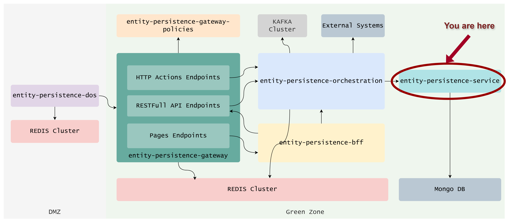

- [Entity Persistence Service](#entity-persistence-service)
  - [What is Tarcinapp?](#what-is-tarcinapp)
  - [Features](#features)
  - [Benefits](#benefits)
- [Getting Started](#getting-started)
- [Concepts](#concepts)
  - [Data Model](#data-model)
    - [Entities](#entities)
    - [Lists](#lists)
    - [List-Entity Relations](#list-entity-relations)
    - [Entity Reactions](#entity-reactions)
    - [List Reactions](#list-reactions)
  - [Relation](#relation)
  - [Sets](#sets)
    - [Lookups](#lookups)
      - [Reference Types](#reference-types)
      - [Query Structure](#query-structure)
      - [Examples](#examples)
      - [Lookup Scope Options](#lookup-scope-options)
      - [Performance Considerations](#performance-considerations)
    - [Tags](#tags)
  - [Programming Conventions](#programming-conventions)
    - [Managed Fields](#managed-fields)
- [Configuration](#configuration)
    - [Database](#database)
    - [Allowed Kinds](#allowed-kinds)
    - [Uniqueness](#uniqueness)
      - [Configuration Syntax](#configuration-syntax)
      - [Examples](#examples-1)
      - [Error Response](#error-response)
    - [Auto Approve](#auto-approve)
    - [Visibility](#visibility)
    - [Response Limits](#response-limits)
    - [Record Limits](#record-limits)
      - [Configuration Mechanism](#configuration-mechanism)
      - [Configuration Schema](#configuration-schema)
      - [Dynamic Value Interpolation](#dynamic-value-interpolation)
      - [Common Use Cases and Examples](#common-use-cases-and-examples)
      - [Filter Expressions](#filter-expressions)
      - [Set Expressions](#set-expressions)
      - [Error Handling](#error-handling)
    - [Idempotency](#idempotency)
- [Deploying to Kubernetes](#deploying-to-kubernetes)
- [Configuring for Development](#configuring-for-development)
- [Known Issues and Limitations](#known-issues-and-limitations)
    - [1. Idempotency and Visibility](#1-idempotency-and-visibility)
    - [2. Field Selection with Arbitrary Fields](#2-field-selection-with-arbitrary-fields)
    - [3. Version Incrementation for Update All operations.](#3-version-incrementation-for-update-all-operations)
    - [4. Dot Notation in Connected Model Filters for List-Entity Relations](#4-dot-notation-in-connected-model-filters-for-list-entity-relations)
- [References](#references)
  - [Endpoints Reference](#endpoints-reference)
    - [EntityController](#entitycontroller)
    - [ListController](#listcontroller)
    - [ListEntityRelController](#listentityrelcontroller)
    - [EntitiesThroughListController](#entitiesthroughlistcontroller)
    - [ListsThroughEntitiesController](#liststhroughentitiescontroller)
    - [EntityReactionController](#entityreactioncontroller)
    - [ReactionsThroughEntitiesController](#reactionsthroughentitiescontroller)
    - [ListReactionController](#listreactioncontroller)
    - [ReactionsThroughListsController](#reactionsthroughlistscontroller)
    - [PingController](#pingcontroller)
  - [Error Codes Reference](#error-codes-reference)
- [Development Status](#development-status)

# Entity Persistence Service

📌 **Entity Persistence Service** is a REST-based backend microservice and a core component of the **Tarcinapp** ([What is Tarcinapp?](#what-is-tarcinapp)).

📌 The service significantly reduces **Time-To-Value** for digital products, internal tools, and early-stage startups by solving key backend concerns out-of-the-box.

📌 It is built on a simple yet powerful data model composed of **entities**, **lists**, and **reactions**, each represented as JSON documents stored in MongoDB. See [Data Model](#data-model) or take a look at the [OpenAPI Specification](https://redocly.github.io/redoc/?url=https://raw.githubusercontent.com/tarcinapp/entity-persistence-service/refs/heads/dev/openapi.json) for more information.

📌 This generic, extensible model allows developers to represent a wide variety of use cases across different domains by reusing and configuring the same foundational components.

📌 Each model can store arbitrary properties.

📌 For example:
- **Entities** can represent user profiles, configuration objects, notification, blog posts, products, campaigns, documents, or even IoT devices.
- **Lists** can model playlists, wishlists, saved searches, shopping carts, or collections.
- **Reactions** can track likes, ratings, flags, reviews, bookmarks, follows, or measurement signals from IoT devices.

📌 Each record — whether an entity, list, or reaction — is automatically decorated with a consistent set of **managed fields**, including:
- `_id`
- `_ownerUsers`, `_ownerGroups`
- `_viewerUsers`, `_viewerGroups`
- `_visibility`
- `_parents`
- `_createdBy`
- `_createdDateTime`
- `_lastUpdatedBy`
- `_lastUpdatedDateTime`
- `_version`
- `_idempotencyKey`
- and more...

These fields are used for various purposes, such as traceability, and are evaluated by the gateway to support essential functionality, including access control, idempotency, and distributed locking.

## What is Tarcinapp?

**Tarcinapp** is a modular backend microservices suite designed to streamline common challenges in REST-based backend development, helping teams reduce **Time-to-Value** from concept to deployment.

While many tools exist to generate REST APIs from JSON schemas, they often stop at basic CRUD operations. These solutions typically lack support for more advanced concerns—such as managing **relationships between records**, handling **ownership and access control**, or modeling **user interactions in post-login scenarios**.

Tarcinapp addresses these gaps with **opinionated models**, built-in metadata, and a gateway architecture that enables secure, configurable behaviors out of the box.

The suite is composed of purpose-specific services for different layers of a modern backend system, including:

- `entity-persistence-dos`
- `entity-persistence-gateway`
- `entity-persistence-gateway-policies`
- `entity-persistence-orchestration`
- `entity-persistence-bff`
- `entity-persistence-service` _(you are here)_

<p align="left">
  
</p>

📘 For a full overview and integration guidance, refer to the [Tarcinapp Suite Documentation](#).

Documentation for each Tarcinapp component is available in their respective repositories:

📄 [entity-persistence-gateway](#)
📄 [entity-persistence-gateway-policies](#)

## Features

- 🔍 **Advanced querying** via flexible query string notation
- 📈 **Record limits** by user, type, or custom context (e.g., number of entities in a list)
- 🔒 **Uniqueness constraints** across user or global scopes
- 📦 **Paginated responses** with configurable limits
- 👥 **Ownership & viewership metadata** to support role-based access enforcement via gateway
- 🌀 **Idempotent operations**, configurable per use case
- 🌐 **Visibility levels** (`public`, `protected`, `private`) with default enforcement
- ✅ **Approval gating** using `validFromDateTime`
- 🗑️ **Soft deletion** via `validUntilDateTime`
- 🕓 **Full audit metadata tracking** (created/updated timestamps and users)

## Benefits
> ⚡ **Tarcinapp dramatically reduces time-to-value** for digital products by delivering a ready-to-use backend built on practical defaults. With generic yet powerful data structures (entities, lists, reactions), configurable authorization, and automation-ready metadata, developers can go from concept to working prototype in days—not weeks.
- **Generic data model** for diverse use cases:  
  - **Entities**: products, users, blog posts, devices  
  - **Lists**: shopping carts, saved searches, collections  
  - **Reactions**: likes, ratings, reviews, measurements

- **Relationship support** between entities and lists enables nested structures like categories, playlists, campaign groups, and workflows.

- **Ownership and access control** with built-in fields like `_ownerUsers`, `_viewerGroups`, `_visibility`—integrated with the gateway for full authorization enforcement.

- **Idempotency and uniqueness** support via configurable fields and scopes.  
  _Example: Prevent duplicate product names per seller._

- **Flexible querying and pagination**, with alias-based filters and response size limits to simplify client logic and protect performance.

- **Approval and soft deletion** using `_validFromDateTime` and `_validUntilDateTime`.  
  _Example: Schedule future-dated articles or auto-expiring invites._

- **Distributed locking** ensures race condition protection when creating or updating data—powered by Redis via the gateway.

- **Custom record constraints** to limit number of entities, reactions, or list items globally, per user, or per context.

- **Optional schema validation** and reference resolution with tapp:// URIs for resolving related records dynamically.

# Getting Started

Once the application is up and running:

- It starts listening on **port 3000** for HTTP requests.
- Spins up an in-memory MongoDB instance, for non-production environments
- Ready to integrate with entity-persistence-gateway
- Resources created through gateway are kept private to the creator users, and visible only to the creators
- Ready to create and query resources. See [Endpoints Reference](#endpoints-reference) or take a look at the [OpenAPI Specification](https://redocly.github.io/redoc/?url=https://raw.githubusercontent.com/tarcinapp/entity-persistence-service/refs/heads/dev/openapi.json) for more information about the endpoints.
- An empty request to `POST /entities` will create a new entity with following properties:
  <p align="left">
    
  </p>
- Some properties (e.g. `_idempotencyKey`) are hidden from the response but can be used for querying and filtering. See [Managed Fields](#managed-fields) for more information.
- `_createdBy`, `_ownerUsers` and `_lastUpdatedBy` are populated with the user id of the creator, when request is made through the gateway.
- You can use payload to pass arbitrary properties to the request. Incoming payload will be merged with the managed fields.
- See [Querying Data](#querying-data) for more information about the advanced querying capabilities.
- Configure the behavior of the service, such as default visibility, record limits, and more, through environment variables. See [Configuration](#configuration) for more information.
- Experiment with creating and querying Entities, Lists, ListEntityRelations and Reactions (See [Endpoint Reference](#endpoints-reference) for more information)

# Concepts

## Data Model

Many digital applications—despite differing in purpose—share a set of common data relationships. Based on this observation, Entity Persistence Service defines a generic yet expressive data model consisting of **entities**, **lists**, and **reactions**.

This structure is designed to flexibly represent a wide range of use cases, including startup MVPs, AI-driven tools, internal request systems, feedback collectors, collaborative platforms, user notifications systems, and user preference managers.
  
<p align="left">
  
</p>

⭐ **Store Any Shape of Data**

Each model—Entity, List, Reactions, and even ListEntityRelation—can hold arbitrary JSON structures tailored to your application's needs. This allows you to enrich records with domain-specific fields without rigid schemas.

When structure is needed, the gateway can validate these records against configurable JSON Schemas based on their `_kind`, offering the best of both flexibility and consistency.

⭐ **Decoration with Managed Fields**

When records are created or updated through **Entity Persistence Service**, the system automatically **decorates the incoming JSON data** with a set of managed fields. These fields support core capabilities like:

- Ownership and visibility control (`_ownerUsers`, `_viewerGroups`, `_visibility`)
- Metadata tracking (`_createdBy`, `_lastUpdatedDateTime`, `_version`)
- Query optimizations (`_parentsCount`, `_ownerUsersCount`, etc.)

Managed fields are either:
- **Strictly controlled** by the application (e.g., `_version`, `_idempotencyKey`)
- **Auto-filled** when missing (e.g., `_slug`, `_creationDateTime`)
- **Policy-controlled**: their visibility and mutability depend on security policies evaluated at the gateway level

See the example below for a request to create an entity and the decorated data stored in the database:
<p align="left">
  
</p>

Some fields are returned in API responses, while others are hidden but still play an important role in filtering. For example:  
This query returns all top-level records (i.e., those without parents), thanks to the internally computed `_parentsCount`.  
`GET /entities?filter[where][_parentsCount]=0`  

See [Managed Fields](#managed-fields) or [Querying Data](#querying-data) for more information.

⭐ **Using `_kind` to Organize Data Variants**

Each model (entity, list, list-entity-relation, list-reaction, entity-reaction) includes an optional `_kind` field used to distinguish different types of data stored within the same MongoDB collection. By default, this field is auto-filled with the model name (`entity`, `list`, `list-entity-relation`, `list-reaction`, `entity-reaction`, etc.), but it can be customized to represent domain-specific subtypes.

This allows applications to store diverse schemas under a shared model—for example, storing `blog-post`, `product`, and `profile` under the same `entity` collection— **while still enabling filtering, validation, or constraints based on kind.**

The `_kind` field is especially helpful when the application needs to apply different logic, limits, or schema validations per subtype. Admins can configure allowed `_kind` values for each model to enforce consistency and avoid accidental misuse.

⭐ **Build Hierarchical Structures Across Models**

Each core model — Entity, List, EntityReaction, ListReaction — supports hierarchy out of the box. A record can define one or more parents using special reference fields (`_parents`), enabling the creation of nested structures.

This allows you to represent:
- Entity taxonomies (e.g., categories and subcategories)
- List groupings (e.g., curated playlist collections)
- Threaded reactions (e.g., nested comments or replies)

Hierarchies are navigable via `{id}/parents` and `{id}/children` endpoints, and can be controlled with configurable constraints to match your application's needs.

⭐ **Data Relations**

Introducing relations to an application raise a lot of complexities which is intended. Real world applications always have relational data.
Tarcinapp opinionated approach contains data relations and aims to solve these complexities.
Parent-child relations for entities, lists and reactions.
List-to-entity
  To add an entity to a list user must be owner of the list. This is enforced by the gateway.
  User must be able to see the entity.
  Number of entities under a list can be configured
  This type of relation can be queried by the fields of list or entity. Such as give me entities whose list's foo field is bar.
  Relation itself an individual record.
  Relation records do not contain visibility and ownership metadata.
  visibility and ownership depends on the visibility of the list and entity. for example to see the relation user must be able to see the list and entity.
  Relation itself can hold arbitrary data.

List-to-reaction or entity-to-reaction
  No need to be owner of the list or entity, but user must be able to see the list or entity. This is also enforced by the gateway.
  Number of reactions under a list or entity can be configured

Lookups
  Lookups are secured by the gateway. access control is applied.

### Entities
The Entity is the core data model that represents the primary objects in your application. It's typically the starting point when modeling your domain. Whether you're building a book review platform, an e-commerce store, a knowledge base, or a job board—books, products, articles, or job listings would all likely to be stored as entities. Entities hold the core business data and can be extended or connected to other models such as lists or reactions to build richer experiences. 

**Base Endpoint**: `/entities`  
**Entities under a list**: `/lists/{listId}/entities`  
**Parents of an entity**: `/entities/{entityId}/parents`  
**Children of an entity**: `/entities/{entityId}/children`


See [Endpoints Reference - EntityController](#entitycontroller) for overview about the endpoints.  
See [OpenAPI Specification](https://redocly.github.io/redoc/?url=https://raw.githubusercontent.com/tarcinapp/entity-persistence-service/refs/heads/dev/openapi.json#tag/EntityController) for more information about the endpoints.

### Lists

The List model organizes collections of entities into meaningful groups. A single list can contain many entities, and an entity can belong to many lists. This many-to-many relationship is managed through a dedicated ListEntityRelation model, enabling fine-grained control over each association. Lists themselves are also records that can hold arbitrary data and can be categorized by kind—such as "favorites," "watchlist," or "top_picks." Whether you're modeling playlists, reading lists, or campaign groupings, lists make it easy to structure and reuse related content across your application.

**Base Endpoint**: `/lists`  
**Entities under a list**: `/lists/{listId}/entities`  
**Parents of a list**: `/lists/{listId}/parents`  
**Children of a list**: `/lists/{listId}/children`

See [Endpoints Reference - ListController](#listcontroller) for overview about the endpoints.  
See [OpenAPI Specification](https://redocly.github.io/redoc/?url=https://raw.githubusercontent.com/tarcinapp/entity-persistence-service/refs/heads/dev/openapi.json#tag/ListController) for more information about the endpoints.

### List-Entity Relations

The **ListEntityRelation** model manages the many-to-many relationship between entities and lists. It enables associating any entity with one or more lists, and vice versa, allowing you to build collections like "featured products," "reading lists," or "user watchlists."  

Each relation is represented as a separate record, containing mandatory `_listId` and `_entityId` fields. This design not only simplifies management of complex associations but also allows storing **custom metadata** for each relation. For example, when an entity is added to a list, you can attach contextual data like the reason for inclusion, sort order, tags, or notes.  

Thanks to ListToEntityRelation, you can:
- Query all **entities in a list** using `/lists/{listId}/entities`  
- Query all **lists an entity belongs to** using `/entities/{entityId}/lists`  

Additionally, responses for these queries include `_fromMetadata` and `_toMetadata` fields that expose the metadata attached to the relation from both sides (list → entity and entity → list), making it easy to customize display logic and behaviors based on relation context.

**Base Endpoint:** /list-entity-relations  
**Entities under a list:** /lists/{listId}/entities  
**Lists containing an entity:** /entities/{entityId}/lists  

See [Endpoints Reference - ListEntityRelController](#listentityrelcontroller) for overview about the endpoints.  
See [OpenAPI Specification](https://redocly.github.io/redoc/?url=https://raw.githubusercontent.com/tarcinapp/entity-persistence-service/refs/heads/dev/openapi.json#tag/ListEntityRelController) for more information about the endpoints.


Lists and entities are connected through the `ListEntityRelation` model. 

Model of the relation object is as follows:

```json
{
  "_kind": "string",
  "_creationDateTime": "2024-12-19T12:56:59.656Z",
  "_lastUpdatedDateTime": "2024-12-19T12:56:59.656Z",
  "_validFromDateTime": "2024-12-19T12:56:59.656Z",
  "_validUntilDateTime": "2024-12-19T12:56:59.656Z",
  "_listId": "string",
  "_entityId": "string",
  "_fromMetadata": {},
  "_toMetadata": {},
  "_idempotencyKey": "string",
  "_version": 0,
  "_lastUpdatedBy": "string",
  "_createdBy": "string",
  "_additionalProp1": {}
}
```

* You can query (get), create (post), replace (put), update (patch), delete (delete) entities through lists calling the endpoint: `/list-entity-relations`.
* This endpoint supports filtering capabilities with `sets` just like other endpoints like `/lists` and `/entities`. See [Sets](#sets) for more information about the Set feature.
* Uniqueness, idempotency, auto-approve, record-limit, response-limit settings can be configured for individual relationship records.
* ownership (_ownerUsers, _ownerGroups), viewership (_viewerUsers, _viewerGroups) and _visibility controls are not defined in the `ListEntityRelation` model. Instead, these properties are returned under the _fromMetadata and _toMetadata fields from the connected List and Entity. Authorization is enforced under "Anyone can see the list and the entity, can see the relation" principle.
* `listFilter`, `listSet`, `entityFilter` and `entitySet` can be passed as query parameter while querying the `/list-entity-relations` endpoint.

A sample response to the `GET /list-entity-relations` endpoint is as follows:

```json
[
    {
        "_id": "a6d5f090-76ba-45c3-8ea2-9785f2237382",
        "_kind": "relation",
        "_lastUpdatedDateTime": "2024-12-16T17:42:01.522Z",
        "_validFromDateTime": null,
        "_validUntilDateTime": null,
        "_listId": "e24ad71e-9041-4570-affe-04db7aca2efb",
        "_entityId": "408d809c-ff00-4969-b8a0-01b8a64aa359",
        "_fromMetadata": {
            "_validFromDateTime": null,
            "_validUntilDateTime": null,
            "_visibility": "protected",
            "_ownerUsers": [
                "user-id-1",
                "user-id-2"
            ],
            "_ownerGroups": [],
            "_viewerUsers": [],
            "_viewerGroups": []
        },
        "_toMetadata": {
            "_validFromDateTime": null,
            "_validUntilDateTime": null,
            "_visibility": "private",
            "_ownerUsers": [],
            "_ownerGroups": [],
            "_viewerUsers": [],
            "_viewerGroups": []
        },
        "_version": 4,
        "_arbitraryProperty": "foo"
    }
]
```

Notice fields like `_fromMetadata` and `_toMetadata` fields are are added to the response along with managed fields.  
  
`_fromMetadata`: This field includes metadata (managed fields) of the source object, which is the list in this case.
`_toMetadata`: This field includes metadata (managed fields) of the target objcet, which is the entity in this case.  


**Note:** Creation or update operations always require existence of the list and entity specified by the ids.

With the help of the relationship between lists and entities users can interact with entities under a specific list calling this endpoint: `/lists/{listId}/entities`.

A sample response of the `GET` call to the `/lists/{listId}/entities` endpoint is as follows:

```json

```

Similarly, you can retrieve all lists associated with a specific entity using the `/entities/{id}/lists` endpoint. This endpoint allows you to find all lists that contain a particular entity, with support for filtering both the lists and the relationship data using `filter`, `filterThrough`, `set` and `setThrough` parameters respectively.

### Entity Reactions

The Entity Reaction data model is responsible for capturing and managing a broad spectrum of events related to objects within your application. It offers the flexibility to represent a wide range of actions and interactions, including comments, likes, measurements, and emotional responses. With this model, your application can handle diverse reactions and interactions associated with entities effectively, enriching user engagement and data interactivity.

### List Reactions

Similar to the Entity Reaction model, the List Reaction data model is tailored to manage events associated with lists. It empowers your application to capture actions like comments, likes, measurements, and reactions linked to lists. This versatility ensures that your application can effectively handle a variety of reactions and interactions related to lists, enhancing user participation and interaction.


## Relation

Relations are individual records just like entities and lists. Relations can hold arbitrary data along with the managed fields. Each time a relation is queried existence of the source and the target record is always checked. With the help of the relations entities under specific list, or reactions under specific list or entity can be queried.  
`/lists/{listId}/entities`  
`/entities/{entityId}/reactions`  
While querying the target record with the notation above, users can filter by the relation object using the `filterThrough` extension. For instance:  
`/lists/{listId}/entities?filterThrough[where][kind]=consists`  

## Sets

Sets are a powerful feature introduced in the application, designed to streamline data filtering and selection. They provide a convenient and flexible way to retrieve specific subsets of data based on predefined conditions or custom logical combinations.

**Features of Sets:**

1. **Combining Sets with Logical Operators:** Sets can be combined using logical operators such as AND, OR, and NOT, enabling users to construct complex queries tailored to their specific needs.
`?set[and][0][actives]&set[and][1][publics]`
2. **Default Filtering with Sets:** Users can still apply default filtering to sets. For example, using the query parameter **`set[actives]&filter[where][_kind]=config`** allows users to select all active data with a **`_kind`** value of **`config`**.
3. **setThrough:** Users can apply `setThrough` query parameter while querying a data through relationship such as `/lists/{listId}/entities?setThrough[actives]`. This query will retrieve entities under the list specified by `{listId}` and relation record is active.
4. **Enforced Sets for Role-Based Access Control:** Sets can be enforced, ensuring that users work on specific predefined sets. The Gateway application facilitates the creation of sets according to role-based access control policies, enhancing data security and access control.
5. **whereThrough**: Users can apply `whereThrough` query parameter while performing delete or updateAll on the generic-entities through relationship such as `PATCH /lists/{listId}/entities?whereThrough[foo]=bar`. This operation will be applied to the entities under the list specified by `{listId}` and the relationship record with the field `foo` equals to `bar`.
6. **Sets with Inclusion Filter**: Users can apply sets to include filter. For example: `?filter[include][0][relation]=_entities&filter[include][0][set][and][0][actives]&filter[include][0][set][and][1][publics]`

**List of Prebuilt Sets:**
The application comes with a set of prebuilt sets to simplify common data selections. Each set is designed to retrieve specific subsets of data based on predefined conditions. Here are the prebuilt sets:

| Set Name  | Description                                                                                                                                                                                                                                                                                  |
| --------- | -------------------------------------------------------------------------------------------------------------------------------------------------------------------------------------------------------------------------------------------------------------------------------------------- |
| publics   | Selects all data with a visibility (visibility) value of public.                                                                                                                                                                                                                             |
| actives   | Selects all data where the _validFromDateTime is not null, less than the current date time, and the_validUntilDateTime field is either null or greater than the current date time.                                                                                                           |
| inactives | Selects all data where the _validUntilDateTime field has a value and is less than the current date time.                                                                                                                                                                                     |
| pendings  | Selects all data where the _validFromDateTime field is empty.                                                                                                                                                                                                                                |
| owners    | Selects all data where the given user ID is in the _ownerUsers or the given group is in the_ownerGroups. User IDs and groups should be provided as comma-separated values in the query variable: set[owners][userIds]=userId1,userId2&set[owners][groupIds]=groupId1,groupId2.               |
| viewers   | Selects all data where the given user ID is in the _viewerUsers or the given group is in the_viewerGroups. User IDs and groups should be provided as comma-separated values in the query variable: set[viewers][userIds]=userId1,userId2&set[viewers][groupIds]=groupId1,groupId2.           |
| day       | Selects all data where the creationDateTime field is within the last 24 hours.                                                                                                                                                                                                               |
| week      | Selects all data where the creationDateTime field is within the last 7 days.                                                                                                                                                                                                                 |
| month     | Selects all data where the creationDateTime field is within the last 30 days.                                                                                                                                                                                                                |
| audience  | A combination of multiple sets. This set returns 'active' and 'public' records along with a user's own active and pending records. As a result, it requires user and group IDs similar to the owners set. Requires userIds and groupIds as defined in `owners` and `viewers` configurations. |
| roots     | Selects all data where the _parentsCount field is 0, meaning these are root-level records that are not children of any other record.                                                                                                                                                         |
| expired30 | Selects all data where the _validUntilDateTime field has a value and is between the current time and 30 days ago, indicating records that have expired within the last 30 days.                                                                                                              |

The introduction of sets enhances the application's querying capabilities, allowing users to easily access and manage specific subsets of data based on predefined conditions or customized logical combinations.

### Lookups

The application provides a powerful lookup mechanism that allows you to resolve entity references in your queries. This feature supports various types of relationships and nested property lookups.

#### Reference Types

The lookup mechanism supports different types of references based on the reference string format:

- Entity References: `tapp://localhost/entities/{entityId}`
- List References: `tapp://localhost/lists/{listId}`

#### Query Structure

Lookups can be specified in the filter query string using the `lookup` parameter. The structure is similar to Loopback's relation queries:

```typescript
// Basic lookup
?filter[lookup][0][prop]=parents

// Lookup with field selection
?filter[lookup][0][prop]=parents&filter[lookup][0][scope][fields][name]=true

// Lookup with where conditions
?filter[lookup][0][prop]=parents&filter[lookup][0][scope][where][_kind]=category

// Lookup with sets
?filter[lookup][0][prop]=parents&filter[lookup][0][scope][set][actives]

// Multiple lookups
?filter[lookup][0][prop]=parents&filter[lookup][1][prop]=children

// Nested lookups
?filter[lookup][0][prop]=parents.foo.bar
```

#### Examples

1. **Basic Entity Lookup**
```typescript
// Get entities with their parent entities resolved
GET /entities?filter[lookup][0][prop]=parents
```

2. **List-Entity Lookup**
```typescript
// Get lists with their entities resolved
GET /lists?filter[lookup][0][prop]=entities
```

3. **Nested Property Lookup**
```typescript
// Get entities with nested references resolved
GET /entities?filter[lookup][0][prop]=metadata.references.parent
```

4. **Lookup with Field Selection**
```typescript
// Get entities with specific fields from their parents
GET /entities?filter[lookup][0][prop]=parents&filter[lookup][0][scope][fields][name]=true
```

5. **Lookup with Conditions**
```typescript
// Get entities with active parents only
GET /entities?filter[lookup][0][prop]=parents&filter[lookup][0][scope][set][actives]
```

6. **Multiple Lookups**
```typescript
// Get entities with both parents and children resolved
GET /entities?filter[lookup][0][prop]=parents&filter[lookup][1][prop]=children
```

7. **List with Entity Lookups**
```typescript
// Get lists with their entities and entity parents resolved
GET /lists?filter[lookup][0][prop]=entities&filter[lookup][0][scope][lookup][0][prop]=parents
```

#### Lookup Scope Options

The `scope` parameter in lookups supports various options:

- `fields`: Select specific fields to include in the resolved entities
- `where`: Apply conditions to filter the resolved entities
- `set`: Apply predefined sets to filter the resolved entities
- `lookup`: Define nested lookups for the resolved entities
- `limit`: Limit the number of resolved entities
- `skip`: Skip a number of resolved entities
- `order`: Sort the resolved entities

#### Performance Considerations

- Lookups are resolved in batches to minimize database queries
- Field selection helps reduce data transfer
- Nested lookups are processed recursively
- Results are cached when possible

### Tags

The updateAll operation is not available for tags since their content is unique, and the only property that might need updating is the "content" property itself. Updating the creationDateTime for all tags would not be meaningful in this context.

## Programming Conventions

1. All database models have id property and it is generated at server side with guid.
2. DateTime fields names are end with '`dateTime`'
3. All managed fields are prefixed with underscore.
Here are the list of common field names.

### Managed Fields

| Field Name               | Description                                                                                                                                                                                                                                                                                                                                                                                                                                                     |
| ------------------------ | --------------------------------------------------------------------------------------------------------------------------------------------------------------------------------------------------------------------------------------------------------------------------------------------------------------------------------------------------------------------------------------------------------------------------------------------------------------- |
| **_id**                  | A string field represents the id of the record.                                                                                                                                                                                                                                                                                                                                                                                                                 |
| **_kind**                | A string field represents the kind of the record.  As this application built on top of a schemaless database, objects with different schemas can be considered as different kinds can be stored in same collection. This field is using in order to seggregate objects in same collection. Most of the configuration parameters can be specialized to be applied on specific kind of objects. **This field is immutable and cannot be changed after creation.** |
| **_name**                | String field represents the name of the record. Mandatory field.                                                                                                                                                                                                                                                                                                                                                                                                |
| **_slug**                | Automatically filled while create or update with the slug format of the value of the name field.                                                                                                                                                                                                                                                                                                                                                                |
| **_visibility**          | Record's visibility level. Can be either `private`, `protected` or `public`. Gateway enforces query behavior based on the visibility level and caller's authorization.                                                                                                                                                                                                                                                                                          |
| **_version**             | A number field that automatically incremented each update and replace operation. Note: `_version` is not incremented if record is updated with `updateAll` operation. Callers are not allowed to modify this field.                                                                                                                                                                                                                                             |
| **_entityId**            | A string field represents the id of the entity. Only used in list-entity-relation and entity-reaction models.                                                                                                                                                                                                                                                                                                                                                   |
| **_listId**              | A string field represents the id of the list. Only used in list-entity-relation and list-reaction models.                                                                                                                                                                                                                                                                                                                                                       |
| **_fromMetadata**        | An object field that used to store metadata of the source list, when querying list-entity-relation models. Only used in list-entity-relation models.                                                                                                                                                                                                                                                                                                            |
| **_toMetadata**          | An object field that used to store metadata of the target entity, when querying list-entity-relation models. Only used in list-entity-relation models.                                                                                                                                                                                                                                                                                                          |
| **_relationMetadata**    | An object field that used to store metadata of the source record (either entity or list), when querying entity-reaction or list-reaction models. Only used in entity-reaction and list-reaction models.                                                                                                                                                                                                                                                         |
| **_ownerUsers**          | An array of user ids.                                                                                                                                                                                                                                                                                                                                                                                                                                           |
| **_ownerGroups**         | An array of user groups.                                                                                                                                                                                                                                                                                                                                                                                                                                        |
| **_ownerUsersCount**     | A number field keeps the number of items in ownerUsers array. Facilitates querying records with no-owners with allowing queries like: `/lists?filter[where][_ownerUsersCount]=0`                                                                                                                                                                                                                                                                                |
| **_ownerGroupsCount**    | A number field keeps the number of items in ownerGroups array. Facilitates querying records with no-owners with allowing queries like: `/lists?filter[where][_ownerGroupsCount]=0`                                                                                                                                                                                                                                                                              |
| **_viewerUsers**         | An array of user ids.                                                                                                                                                                                                                                                                                                                                                                                                                                           |
| **_viewerGroups**        | An array of user groups.                                                                                                                                                                                                                                                                                                                                                                                                                                        |
| **_viewerUsersCount**    | A number field keeps the number of items in viewerUsers array. Facilitates querying records with no-viewers with allowing queries like: `/lists?filter[where][_viewerUsersCount]=0`                                                                                                                                                                                                                                                                             |
| **_viewerGroupsCount**   | A number field keeps the number of items in viewerGroups array. Facilitates querying records with no-viewers with allowing queries like: `/lists?filter[where][_viewerGroupsCount]=0`                                                                                                                                                                                                                                                                           |
| **_parentsCount**        | A number field keeps the number of parents of the record. Facilitates retrieving only parents by this usage: `/entities?filter[where][_parentsCount]=0`                                                                                                                                                                                                                                                                                                         |
| **_createdBy**           | Id of the user who created the record. Gateway *may* allow caller to modify this field. By default only admin users can modify this field.                                                                                                                                                                                                                                                                                                                      |
| **_creationDateTime**    | A date time object automatically filled with the datetime of entity create operation. Gateway *may* allow caller to modify this field. By default only admin users can modify this field.                                                                                                                                                                                                                                                                       |
| **_lastUpdatedDateTime** | A date time object automatically filled with the datetime of any entity update operation. Gateway *may* allow caller to modify this field. By default only admin users can modify this field.                                                                                                                                                                                                                                                                   |
| **_lastUpdatedBy**       | Id of the user who performed the last update operation. Gateway *may* allow caller to modify this field. By default only admin users can modify this field.                                                                                                                                                                                                                                                                                                     |
| **_validFromDateTime**   | A date time object represents the time when the object is a valid entity. Can be treated as the approval time. There is a configuration to auto approve records at the time of creation.                                                                                                                                                                                                                                                                        |
| **_validUntilDateTime**  | A date time object represents the time when the objects validity ends. Can be used instead of deleting records.                                                                                                                                                                                                                                                                                                                                                 |
| **_idempotencyKey**      | A hashed string field should be computed using the record's fields, which are designed to enhance the record's uniqueness.                                                                                                                                                                                                                                                                                                                                      |

**(\*)** Required fields

**Strictly Managed Fields**: `_version`, `_idempotencyKey`, `_parentsCount`,  `_viewerUsersCount`, `_viewerGroupsCount`, `_ownerUsersCount` and `_ownerGroupsCount` fields are calculated at the application logic no matter what value is sent by the caller.  

**Fields Set by Application when Empty**: `_kind`, `_visibility`, `_validFromDateTime`, `_slug`, `_creationDateTime` and `_lastUpdatedDateTime` are calculated at the application logic if it is not specified in the request body. entity-persistence-gateway decides if user is authorized to send these fields by evaluating authorization policies.   

**Gateway Managed Fields**: `_viewerUsers`, `_viewerGroups`, `_ownerUsers`, `_ownerGroups`, `_createdBy`, `_createdDateTime`, `_lastUpdatedBy`, `_lastUpdatedDateTime`, `_validFromDateTime` fields *may* be modified by entity-persistence-gateway. Gateway decides whether it accepts the given value, modifies it, or allows the caller to modify it by evaluating security policies.

**Always Hidden Fields**: `_parentsCount`, `_ownerUsersCount`, `_ownerGroupsCount`, `_viewerUsersCount`, `_viewerGroupsCount` and `_idempotencyKey` fields are hidden from the caller in the response. Yet, these fields can be used while querying records. Gateway decides if caller is authorized to read and query by these fields by evaluating security policies.

**Immutable Fields**: The `_id`, and `_kind` fields are immutable and cannot be changed after record creation. This constraint is enforced because many system configurations and data integrity rules are based on the `_kind` value. Changing the `_kind` of an existing record could lead to inconsistencies in uniqueness constraints, validation rules, visibility settings, and other kind-specific configurations. Any attempt to modify the `_kind` field during update or replace operations will result in a 422 error (Unprocessable Entity) with the code `IMMUTABLE-ENTITY-KIND`.

**Note:** entity-persistence-gateway can decide if *caller* is authorized to change the value of a field by evaluating security policies. Any field can be subjected to the authorization policies. By configuring the authorization policy, you can allow or disallow the caller to change, modify or read the value of any field.

# Configuration

We can divide configurations into 9 categories:

* [Database configurations](#database)
* [Kind configurations](#allowed-kinds)
* [Uniqueness configurations](#uniqueness)
* [Auto approve configurations](#auto-approve)
* [Default visibility configuration](#visibility)
* [Validation configurations](#validation)
* [Response limits configurations](#response-limits)
* [Record limit configurations](#record-limits)
* [Idempotency configurations](#idempotency)

### Database

| Configration                        | Description                                                                      | Default Value       |
| ----------------------------------- | -------------------------------------------------------------------------------- | ------------------- |
| **mongodb_host**                    | MongoDB database hostname                                                        | localhost           |
| **mongodb_port**                    | MongoDB database port number                                                     | 27017               |
| **mongodb_user**                    | MongoDB database user                                                            | tappuser            |
| **mongodb_password**                | MongoDB password. Provide through k8s secrets                                    | tapppass123!        |
| **mongodb_database**                | Name of the database                                                             | tappdb              |
| **mongodb_url**                     | Connection URL can be used instead of host, port and user                        | localhost           |
| **collection_entity**               | Name of the collection which generic entities are persisted                      | GenericEntities     |
| **collection_list**                 | Name of the collection which generic lists are persisted                         | Lists               |
| **collection_list_list_entity_rel** | Name of the collection which relationships between list and entity are persisted | ListEntityRelations |
| **collection_entity_reactions**     | Name of the collection which entity reactions are persisted                      | EntityReactions     |
| **collection_list_reactions**       | Name of the collection which list reactions are persisted                        | ListReactions       |

### Allowed Kinds

You can limit acceptable values for `kind` fields for the records.

| Configuration             | Description                                                                            | Default Value |
| ------------------------- | -------------------------------------------------------------------------------------- | ------------- |
| **entity_kinds**          | Comma seperated list of allowed values for kind field of entities.                     |               |
| **list_kinds**            | Comma seperated list of allowed values for kind field of lists.                        |               |
| **list_entity_rel_kinds** | Comma seperated list of allowed values for kind field of list to entity relationships. | relation      |
| **entity_reaction_kinds** | Comma seperated list of allowed values for kind field of entity reactions.             |               |
| **list_reaction_kinds**   | Comma seperated list of allowed values for kind field of list reactions.               |               |

### Uniqueness

Data uniqueness is configurable using a query-like syntax that allows defining uniqueness rules based on field values and scopes. You can define multiple uniqueness rules by separating them with commas. Each rule consists of:
- Field conditions using `where` clauses that specify which fields must match exactly
- Optional scope conditions using either `where` clauses or predefined `set` expressions
- Template variables that get replaced with actual field values using `${fieldName}` syntax

The configuration supports various uniqueness scenarios:
- Global uniqueness based on specific fields
- Uniqueness within a subset of records (e.g., only active records)
- Uniqueness scoped by field values (e.g., within approved records)
- Multiple uniqueness rules for different combinations

| Configuration                  | Description                                                                                                         | Default Value | Example Value                                                                    |
| ------------------------------ | ------------------------------------------------------------------------------------------------------------------- | ------------- | -------------------------------------------------------------------------------- |
| **ENTITY_UNIQUENESS**          | Defines uniqueness rules for entities. Multiple rules can be specified by separating them with commas.              | -             | `where[_name]=${_name},where[_slug]=${_slug}&set[actives]`                       |
| **LIST_UNIQUENESS**            | Defines uniqueness rules for lists. Multiple rules can be specified by separating them with commas.                 | -             | `where[_name]=${_name}&where[_kind]=${_kind},where[_slug]=${_slug}&set[publics]` |
| **RELATION_UNIQUENESS**        | Defines uniqueness rules for list-entity relations. Multiple rules can be specified by separating them with commas. | -             | `where[_listId]=${_listId}&where[_entityId]=${_entityId}`                        |
| **ENTITY_REACTION_UNIQUENESS** | Defines uniqueness rules for entity reactions. Multiple rules can be specified by separating them with commas.      | -             | `where[_entityId]=${_entityId}&where[type]=${type}&set[actives]`                 |
| **LIST_REACTION_UNIQUENESS**   | Defines uniqueness rules for list reactions. Multiple rules can be specified by separating them with commas.        | -             | `where[_listId]=${_listId}&where[type]=${type}&set[actives]`                     |

#### Configuration Syntax

The uniqueness configuration uses a query-like syntax with these components:

1. **Field Uniqueness** (using `where` clauses):
   ```bash
   where[field_name]=${field_name}
   ```
   This specifies which fields must be unique.

2. **Scope Definition**:
   - Using predefined sets:
     ```bash
     set[actives]  # Only check uniqueness among active records
     set[publics]  # Only check uniqueness among public records
     ```
   - Using where clauses:
     ```bash
     where[status]=approved  # Only check uniqueness among approved records
     ```

3. **Template Variables**:
   ```bash
   ${_name}, ${_slug}, ${_kind}, etc.
   ```
   These get replaced with actual field values from the record.

#### Examples

1. **Simple Field Uniqueness**:
   ```bash
   # Only one record can exist with a given name
   ENTITY_UNIQUENESS="where[_name]=${_name}"
   ```

2. **Multiple Field Uniqueness**:
   ```bash
   # Name must be unique within each kind
   ENTITY_UNIQUENESS="where[_name]=${_name}&where[_kind]=${_kind}"
   ```

3. **Uniqueness Within Active Records**:
   ```bash
   # Only one active record can exist with a given name
   ENTITY_UNIQUENESS="where[_name]=${_name}&set[actives]"
   ```

4. **Uniqueness Within Approved Records**:
   ```bash
   # Only one record with status=approved can exist with a given name
   ENTITY_UNIQUENESS="where[_name]=${_name}&where[status]=approved"
   ```

5. **Multiple Uniqueness Rules**:
   ```bash
   # Rule 1: Name must be unique globally
   # Rule 2: Slug must be unique among active records
   ENTITY_UNIQUENESS="where[_name]=${_name},where[_slug]=${_slug}&set[actives]"
   ```

6. **Complex Scoping**:
   ```bash
   # Name must be unique among active and public records
   ENTITY_UNIQUENESS="where[_name]=${_name}&set[actives]&set[publics]"
   ```

7. **Combined Where and Set Scoping**:
   ```bash
   # Name must be unique within each department among active records
   ENTITY_UNIQUENESS="where[_name]=${_name}&where[department]=${department}&set[actives]"
   ```

For available sets and their behaviors that can be used in uniqueness rules, see the [Sets](#sets) section.

#### Error Response

When a uniqueness violation occurs, the API returns a detailed error response:

```json
{
  "error": {
    "statusCode": 409,
    "name": "UniquenessViolationError",
    "message": "Entity already exists",
    "code": "ENTITY-UNIQUENESS-VIOLATION",
    "status": 409,
    "details": [
      {
        "code": "ENTITY-UNIQUENESS-VIOLATION",
        "message": "Entity already exists",
        "info": {
          "scope": "where[_name]=example&set[actives]"
        }
      }
    ]
  }
}
```

The error response includes:
- The specific uniqueness rule that was violated
- The scope where the violation occurred
- The field values that caused the conflict

### Auto Approve

| Configration                                         | Description                                                                                                          | Default Value | Example Value |
| ---------------------------------------------------- | -------------------------------------------------------------------------------------------------------------------- | ------------- | ------------- |
| **autoapprove_entity**                               | If true, `validFromDateTime` field of entity record is automatically filled with the creation datetime.              | false         | true          |
| **autoapprove_entity_for_{kindName}**                | If true, `validFromDateTime` field of entity record in this kind is automatically filled with the creation datetime. | false         | true          |
| **autoapprove_list**                                 | If true, `validFromDateTime` field of list record is automatically filled with the creation datetime.                | false         | true          |
| **autoapprove_list_for_{kindName}**                  | If true, `validFromDateTime` field of list record in this kind is automatically filled with the creation datetime.   | true          | false         |
| **autoapprove_list_entity_relations**                | If true, `validFromDateTime` field of relation record is automatically filled with the creation datetime.            | false         | true          |
| **autoapprove_list_entity_relations_for_{kindName}** | If true, `validFromDateTime` field of relation record is automatically filled with the creation datetime.            | false         | true          |
| **autoapprove_entity_reaction**                      | If true, `validFromDateTime` field of entity reaction record is automatically filled with the creation datetime.     | false         | true          |
| **autoapprove_list_reaction**                        | If true, `validFromDateTime` field of list reaction record is automatically filled with the creation datetime.       | false         | true          |

### Visibility

This option only applies when visibility field is not provided. If you want to apply a visibility rule bu user role, please see entity-persistence-gateway.

| Configuration                                  | Description                                                                                                                                      | Default Value | Example Values  |
| ---------------------------------------------- | ------------------------------------------------------------------------------------------------------------------------------------------------ | ------------- | --------------- |
| **visibility_entity**                          | Default value to be filled for `visibility` field while entity creation.                                                                         | protected     | public, private |
| **visibility_entity_for_{kind_name}**          | Default value to be filled for `visibility` field while entity creation. This configuration will only be applied to that specific kind.          | protected     | public, private |
| **visibility_list**                            | Default value to be filled for `visibility` field while list creation.                                                                           | protected     | public, private |
| **visibility_list_for_{kind_name}**            | Default value to be filled for `visibility` field while list creation. This configuration will only be applied to that specific kind.            | protected     | public, private |
| **visibility_entity_reaction**                 | Default value to be filled for `visibility` field while entity reaction creation.                                                                | protected     | public, private |
| **visibility_entity_reaction_for_{kind_name}** | Default value to be filled for `visibility` field while entity reaction creation. This configuration will only be applied to that specific kind. | protected     | public, private |
| **visibility_list_reaction**                   | Default value to be filled for `visibility` field while list reaction creation.                                                                  | protected     | public, private |
| **visibility_list_reaction_for_{kind_name}**   | Default value to be filled for `visibility` field while list reaction creation. This configuration will only be applied to that specific kind.   | protected     | public, private |

### Response Limits

These setting limits the number of record can be returned for each data model. If user asks more items than the limits, it is silently reduced to the limits given the configuration below.

| Configration                       | Description                                              | Default Value |
| ---------------------------------- | -------------------------------------------------------- | ------------- |
| **response_limit_entity**          | Max items can be returned from entity response.          | 50            |
| **response_limit_list**            | Max items can be returned from list response.            | 50            |
| **response_limit_list_entity_rel** | Max items can be returned from list response.            | 50            |
| **response_limit_entity_reaction** | Max items can be returned from entity reaction response. | 50            |
| **response_limit_list_reaction**   | Max items can be returned from list reaction response.   | 50            |
| **response_limit_tag**             | Max items can be returned from tags response.            | 50            |

### Record Limits

The record limit mechanism allows you to control the number of records that can be created in the system. It provides a flexible way to define limits based on various criteria such as record type, kind, ownership, and state.

#### Configuration Mechanism

Record limits are configured through environment variables using a JSON-based notation. Each type of record (entity, list, relation, reactions) has its own configuration variable:

| Environment Variable            | Description                                 |
| ------------------------------- | ------------------------------------------- |
| `ENTITY_RECORD_LIMITS`          | Configures limits for entity records        |
| `LIST_RECORD_LIMITS`            | Configures limits for list records          |
| `RELATION_RECORD_LIMITS`        | Configures limits for list-entity relations |
| `ENTITY_REACTION_RECORD_LIMITS` | Configures limits for entity reactions      |
| `LIST_REACTION_RECORD_LIMITS`   | Configures limits for list reactions        |

#### Configuration Schema

Each environment variable accepts a JSON array of limit configurations:

```json
[
  {
    "scope": "string",  // Where clauses or set expressions defining where the limit applies
    "limit": number    // Maximum number of records allowed in this scope
  }
]
```

The `scope` field supports:
- Empty string (`""`) for global limits
- Where clause expressions (`where[field]=value`)
- Set expressions (`set[setname]`)
- Combined expressions using `&` and logical `AND`, `OR` operators

#### Dynamic Value Interpolation

The scope field supports interpolation of record values using `${fieldname}` syntax:
- `${_kind}` - Record's kind
- `${_ownerUsers}` - Record's owner users
- `${_listId}` - Relation's list ID
- Any other field from the record being created

#### Common Use Cases and Examples

1. **Global Record Limit**
   ```bash
   # Limit total entities to 1000
   ENTITY_RECORD_LIMITS='[{"scope":"","limit":1000}]'
   ```

2. **Kind-Specific Limits**
   ```bash
   # Limit book entities to 100, movie entities to 50
   ENTITY_RECORD_LIMITS='[
     {"scope":"where[_kind]=book","limit":100},
     {"scope":"where[_kind]=movie","limit":50}
   ]'
   ```

3. **Active Records Limit**
   ```bash
   # Limit active entities to 50
   ENTITY_RECORD_LIMITS='[{"scope":"set[actives]","limit":50}]'
   ```

4. **Per-User Limits**
   ```bash
   # Limit each user to 10 lists
   LIST_RECORD_LIMITS='[{"scope":"set[owners][userIds]=${_ownerUsers}","limit":10}]'
   ```

5. **Combined Criteria**
   ```bash
   # Limit active public book entities to 20
   ENTITY_RECORD_LIMITS='[{
     "scope":"set[actives]&set[publics]&where[_kind]=book",
     "limit":20
   }]'
   ```

6. **List-Entity Relations**
   ```bash
   # Limit each list to 100 entities
   RELATION_RECORD_LIMITS='[{
     "scope":"where[_listId]=${_listId}",
     "limit":100
   }]'

   # Different limits for different list kinds
   RELATION_RECORD_LIMITS='[
     {"scope":"where[_listId]=${_listId}&where[_kind]=reading-list","limit":10},
     {"scope":"where[_listId]=${_listId}&where[_kind]=watch-list","limit":20}
   ]'
   ```

7. **Multiple Limits**
   ```bash
   # Combined global and kind-specific limits
   LIST_RECORD_LIMITS='[
     {"scope":"","limit":1000},
     {"scope":"where[_kind]=featured","limit":10},
     {"scope":"set[actives]&set[publics]","limit":50}
   ]'
   ```

#### Filter Expressions

Filter expressions use the Loopback query syntax:
- Simple equality: `where[field]=value`
- Multiple conditions: `where[field1]=value1&where[field2]=value2`
- Nested fields: `where[field.nested]=value`

#### Set Expressions

Available sets for filtering:
- `set[actives]` - Currently active records (based on validity dates)
- `set[publics]` - Public records
- `set[owners]` - Records by owner
- `set[viewers]` - Records by viewer
- `set[audience]` - Records by combined owners and viewers

#### Error Handling

When a limit is exceeded, the service returns a 429 error with details:
```json
{
  "statusCode": 429,
  "name": "LimitExceededError",
  "message": "Record limit exceeded for [type]",
  "code": "[TYPE]-LIMIT-EXCEEDED",
  "status": 429,
  "details": [{
    "code": "[TYPE]-LIMIT-EXCEEDED",
    "message": "Record limit exceeded for [type]",
    "info": {
      "limit": number,
      "scope": "string"
    }
  }]
}
```

Where `[type]` is one of: entity, list, relation, entity-reaction, list-reaction.

### Idempotency

entity-persistence-service ensures data creation is efficient and predictable. You can define JSON field paths, and the system generates a unique key based on these values. When clients attempt to create records, the system checks if a matching record exists using this key. If found, it returns the result as if it were a new record.

| Configuration                                  | Description                                                                                                                                               | Default Value | Example Values         |
| ---------------------------------------------- | --------------------------------------------------------------------------------------------------------------------------------------------------------- | ------------- | ---------------------- |
| **idempotency_entity**                         | comma seperated list of field names for entity records that are contributing to the calculation of idempotency key                                        | -             | kind, slug, author     |
| **idempotency_entity_for_{kindName}**          | comma seperated list of field names for entity records with kind value is {kindName} that are contributing to the calculation of idempotency key          | -             | kind, slug, author     |
| **idempotency_list**                           | comma seperated list of field names for list records that are contributing to the calculation of idempotency key                                          | -             | kind, slug             |
| **idempotency_list_for_{kindName}**            | comma seperated list of field names for list records with kind value is {kindName} that are contributing to the calculation of idempotency key            | -             | kind, slug, author     |
| **idempotency_list_entity_rel**                | comma seperated list of field names for entity records that are contributing to the calculation of idempotency key                                        | -             | kind, listId, entityId |
| **idempotency_list_entity_rel_for_{kindName}** | comma seperated list of field names for entity records with kind value is {kindName} that are contributing to the calculation of idempotency key          | -             | kind, listId, entityId |
| **idempotency_entity_reaction**                | comma seperated list of field names for entity reaction records that are contributing to the calculation of idempotency key                               | -             | kind, entityId, type   |
| **idempotency_entity_reaction_for_{kindName}** | comma seperated list of field names for entity reaction records with kind value is {kindName} that are contributing to the calculation of idempotency key | -             | kind, entityId, type   |
| **idempotency_list_reaction**                  | comma seperated list of field names for list reaction records that are contributing to the calculation of idempotency key                                 | -             | kind, listId, type     |
| **idempotency_list_reaction_for_{kindName}**   | comma seperated list of field names for list reaction records with kind value is {kindName} that are contributing to the calculation of idempotency key   | -             | kind, listId, type     |

Please note that idempotency calculation takes place before populating managed fields. Thus, do not use managed fields as contributor to the idempotency. For instance, use `name` instead of `slug`.

# Deploying to Kubernetes

* A configmap and secret sample yaml files are provided

# Configuring for Development

Prepare a mongodb instance. Create a database and a user/pass who is authorized to access to the database. Note the name of the database, username and password.
For example, create a database called tarcinappdb.

```javascript
db.createUser({
  user: "tappuser",
  pwd: "tapppass123!",
  roles: [
    {
      role: "readWrite",
      db: "tappdb"
    }
  ]
})
```

For VSCode, create a dev.env file at the root of your workspace folder. Add local database configuration as environment variables to this file. This file will be read once you start the application in debug mode. Sample .env files can be found under /doc/env folder.

# Known Issues and Limitations

### 1. Idempotency and Visibility

If a user creates a record idempotently, they may receive a success response, even if the previously created idempotent record is set as private. However, due to the visibility settings, the user who attempted to create idempotent record won't be able to view private records created by someone else. This can create a situation where it appears as if the data was created successfully, but it may not be visible to whom created it because of the privacy settings. It's essential to be aware of this behavior when working with idempotent data creation and privacy settings.
This issue is going to be addressed with making `set`s can contribute to the idempotency calculation.

### 2. Field Selection with Arbitrary Fields

All models in the application (entities, lists, relations, and reactions) allow arbitrary fields through `additionalProperties: true` in their model definitions. When using field selection with these models, there is a limitation in Loopback's behavior:

- If you explicitly set any arbitrary field to `false` in the field selection filter, all other arbitrary fields will also be excluded from the response, even if they weren't explicitly mentioned in the filter.
- This behavior affects all arbitrary fields (fields not defined in the model schema) in all models (entities, lists, relations, and reactions).
- Built-in fields (those defined in the model schema, like `_id`, `_name`, `_kind`, etc.) are not affected by this behavior.

Example:
```typescript
// All models allow arbitrary fields
const response = await client.get('/entities').query({
  filter: {
    fields: {
      customField: false    // Setting any arbitrary field to false...
    }
  }
});

// Result: All arbitrary fields (customField, description, and any other custom fields)
// will be excluded from the response, even if not explicitly mentioned in the filter.
// All built-in fields defined in the model schema will be returned by default
```

This is a known limitation in Loopback's implementation of field selection when dealing with models that allow arbitrary fields.

### 3. Version Incrementation for Update All operations.
When performing PATCH or PUT operations on a single record, the version field (_version) is automatically incremented by 1. However, for bulk update operations (updateAll), version tracking is not supported. The version field remains unchanged even when records are modified.

### 4. Dot Notation in Connected Model Filters for List-Entity Relations
When querying list-entity relations, dot notation filtering (e.g., `metadata.status.current`) is not supported in `listFilter` and `entityFilter` parameters for connected models. While other filtering approaches work normally, nested property filtering using dot notation specifically for connected List and Entity models through their relations is not available.

# References


  ## Endpoints Reference

  ### EntityController
  | Method | Endpoint                  | Description              |
  | ------ | ------------------------- | ------------------------ |
  | POST   | `/entities`               | Create new entity        |
  | GET    | `/entities`               | List all entities        |
  | GET    | `/entities/{id}`          | Get entity by ID         |
  | PATCH  | `/entities/{id}`          | Update entity partially  |
  | PUT    | `/entities/{id}`          | Replace entity           |
  | PATCH  | `/entities`               | Update multiple entities |
  | GET    | `/entities/count`         | Get entity count         |
  | POST   | `/entities/{id}/children` | Add child to entity      |
  | GET    | `/entities/{id}/children` | Get entity children      |
  | GET    | `/entities/{id}/parents`  | Get entity parents       |
  | DELETE | `/entities/{id}`          | Delete entity            |

  ### ListController
  | Method | Endpoint               | Description           |
  | ------ | ---------------------- | --------------------- |
  | POST   | `/lists`               | Create new list       |
  | GET    | `/lists`               | List all lists        |
  | GET    | `/lists/{id}`          | Get list by ID        |
  | PATCH  | `/lists/{id}`          | Update list partially |
  | PUT    | `/lists/{id}`          | Replace list          |
  | PATCH  | `/lists`               | Update multiple lists |
  | GET    | `/lists/count`         | Get list count        |
  | POST   | `/lists/{id}/children` | Add child to list     |
  | GET    | `/lists/{id}/children` | Get list children     |
  | GET    | `/lists/{id}/parents`  | Get list parents      |
  | DELETE | `/lists/{id}`          | Delete list           |

  ### ListEntityRelController
  | Method | Endpoint                       | Description                           |
  | ------ | ------------------------------ | ------------------------------------- |
  | POST   | `/list-entity-relations`       | Create new list-entity relation       |
  | GET    | `/list-entity-relations`       | List all list-entity relations        |
  | GET    | `/list-entity-relations/{id}`  | Get list-entity relation by ID        |
  | PATCH  | `/list-entity-relations/{id}`  | Update list-entity relation partially |
  | PUT    | `/list-entity-relations/{id}`  | Replace list-entity relation          |
  | PATCH  | `/list-entity-relations`       | Update multiple list-entity relations |
  | GET    | `/list-entity-relations/count` | Get list-entity relation count        |
  | DELETE | `/list-entity-relations/{id}`  | Delete list-entity relation           |

  ### EntitiesThroughListController
  | Method | Endpoint               | Description          |
  | ------ | ---------------------- | -------------------- |
  | POST   | `/lists/{id}/entities` | Add entities to list |
  | GET    | `/lists/{id}/entities` | Get list entities    |
  | PATCH  | `/lists/{id}/entities` | Update list entities |
  | DELETE | `/lists/{id}/entities` | Delete list entities |

  ### ListsThroughEntitiesController
  | Method | Endpoint               | Description          |
  | ------ | ---------------------- | -------------------- |
  | GET    | `/entities/{id}/lists` | Get lists for entity |

  ### EntityReactionController
  | Method | Endpoint                          | Description                      |
  | ------ | --------------------------------- | -------------------------------- |
  | POST   | `/entity-reactions`               | Create new entity reaction       |
  | GET    | `/entity-reactions`               | List all entity reactions        |
  | GET    | `/entity-reactions/{id}`          | Get entity reaction by ID        |
  | PATCH  | `/entity-reactions/{id}`          | Update entity reaction partially |
  | PUT    | `/entity-reactions/{id}`          | Replace entity reaction          |
  | PATCH  | `/entity-reactions`               | Update multiple entity reactions |
  | GET    | `/entity-reactions/count`         | Get entity reaction count        |
  | POST   | `/entity-reactions/{id}/children` | Add child to entity reaction     |
  | GET    | `/entity-reactions/{id}/children` | Get entity reaction children     |
  | GET    | `/entity-reactions/{id}/parents`  | Get entity reaction parents      |
  | DELETE | `/entity-reactions/{id}`          | Delete entity reaction           |

  ### ReactionsThroughEntitiesController
  | Method | Endpoint                   | Description             |
  | ------ | -------------------------- | ----------------------- |
  | POST   | `/entities/{id}/reactions` | Add reaction to entity  |
  | GET    | `/entities/{id}/reactions` | Get entity reactions    |
  | PATCH  | `/entities/{id}/reactions` | Update entity reactions |
  | DELETE | `/entities/{id}/reactions` | Delete entity reactions |

  ### ListReactionController
  | Method | Endpoint                | Description                    |
  | ------ | ----------------------- | ------------------------------ |
  | POST   | `/list-reactions`       | Create new list reaction       |
  | GET    | `/list-reactions`       | List all list reactions        |
  | GET    | `/list-reactions/{id}`  | Get list reaction by ID        |
  | PATCH  | `/list-reactions/{id}`  | Update list reaction partially |
  | PUT    | `/list-reactions/{id}`  | Replace list reaction          |
  | PATCH  | `/list-reactions`       | Update multiple list reactions |
  | GET    | `/list-reactions/count` | Get list reaction count        |
  | DELETE | `/list-reactions/{id}`  | Delete list reaction           |

  ### ReactionsThroughListsController
  | Method | Endpoint                | Description           |
  | ------ | ----------------------- | --------------------- |
  | POST   | `/lists/{id}/reactions` | Add reaction to list  |
  | GET    | `/lists/{id}/reactions` | Get list reactions    |
  | PATCH  | `/lists/{id}/reactions` | Update list reactions |
  | DELETE | `/lists/{id}/reactions` | Delete list reactions |

  ### PingController
  | Method | Endpoint | Description   |
  | ------ | -------- | ------------- |
  | GET    | `/ping`  | Ping endpoint |

  ## Error Codes Reference
  

# Development Status

* All configurations are fully implemented for generic-entities.
